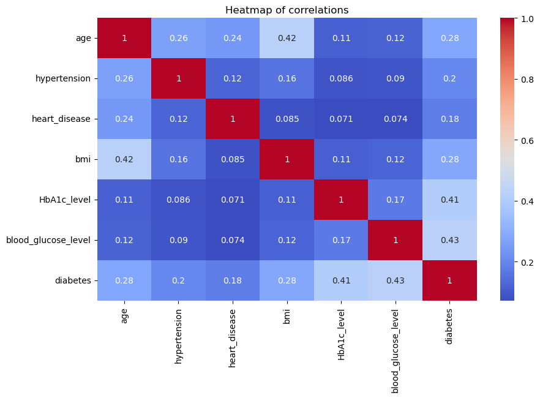
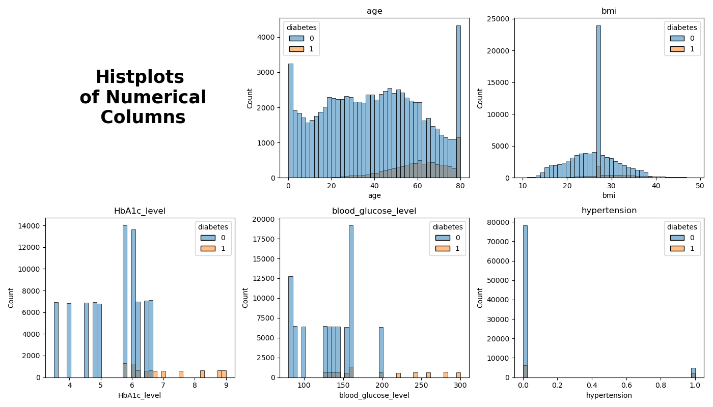
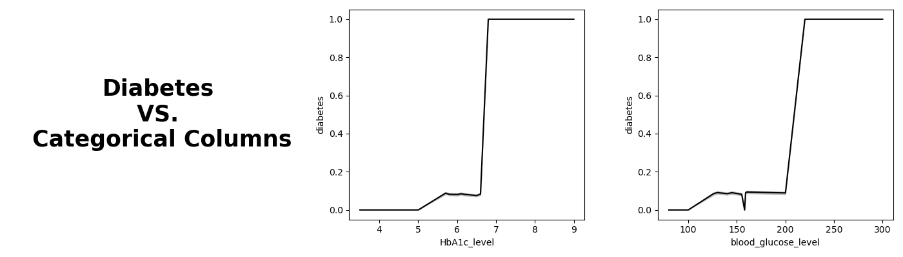
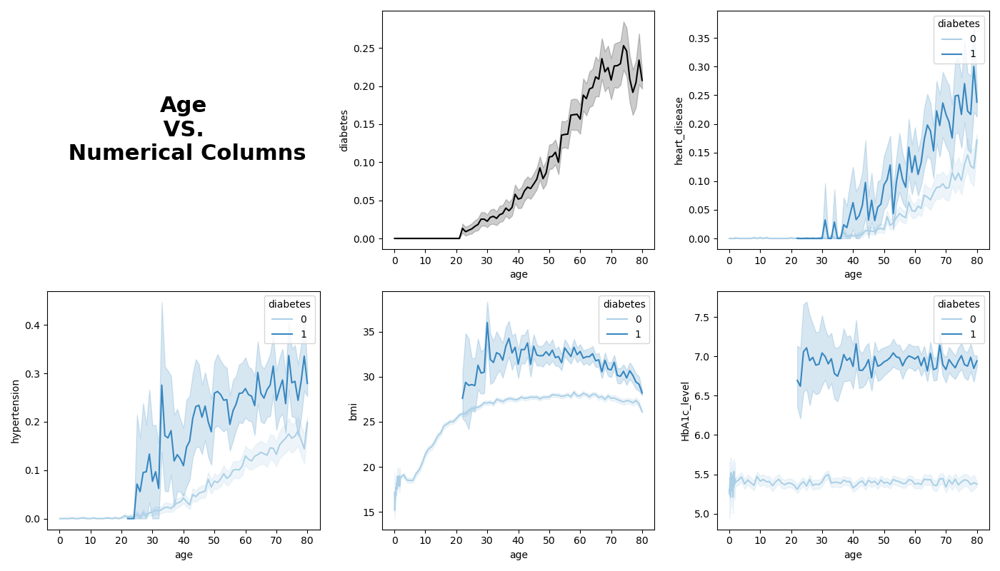
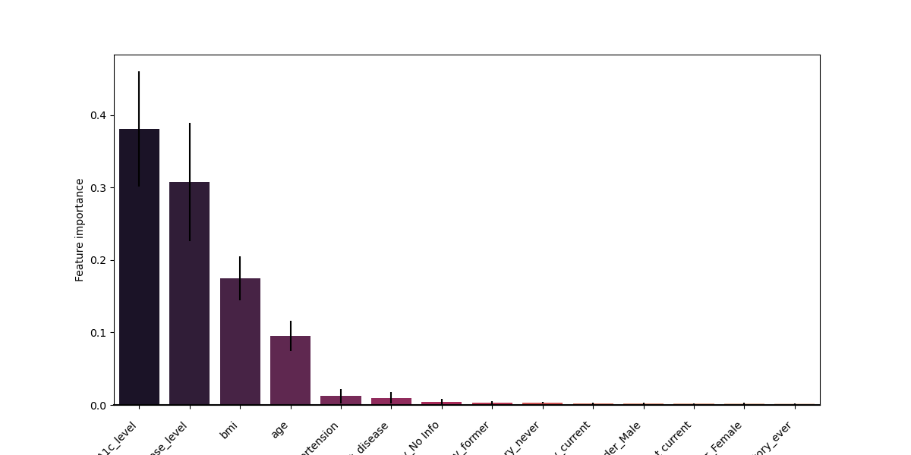
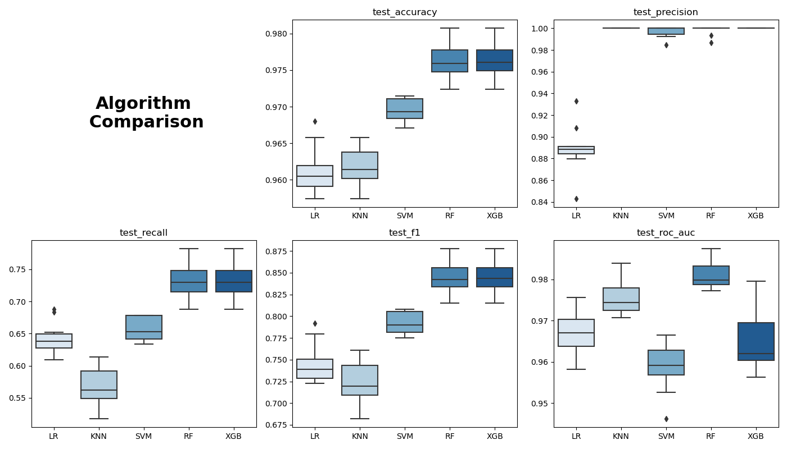
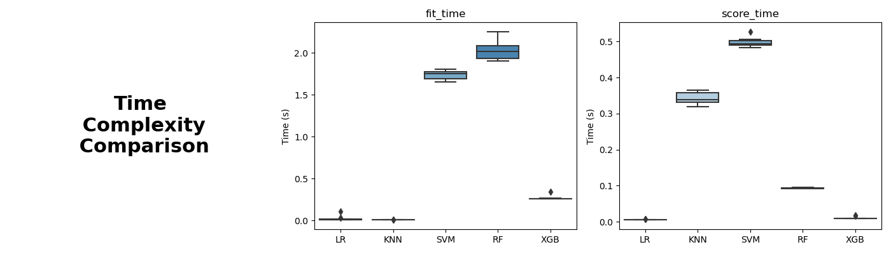

# Diabetes-Status-Classification

## Project Overview

This repository contains a machine learning project focused on classification. 

The objective of this project is to predict the likelihood of diabetes in patients based on their medical history and demographic details. To accomplish this, we conduct an in-depth analysis of various features such as `age`, `gender`, `hypertension`, `BMI`, `blood glucose levels`, and others, utilizing different classifiers such as **Logistic Regression, SVM, K-Nearest Neighbors, Random Forests, and XGBoost**. We assess their performance by tuning different hyperparameters and comparing their results. The performance of the classifiers is measured by **accuracy (ACC), precision (PPV), recall (SEN, sensitivity), F1 score (F1), and the area under the receiver-operating-characteristic curve (AUC)**.

## Materials and Methodology:

### Dataset

The diabetes prediction dataset is stored in the "diabetes_prediction_dataset.csv" file, which includes medical and demographic data of patients. It contains 96146 instances, including 8482 diabetics and 87664 control instances (Imbalanced dataset). The dataset consists of several features, including age, gender, body mass index (BMI), hypertension, heart disease, smoking history, HbA1c level, and blood glucose level.
You may also download it from [Kaggle](https://www.kaggle.com/datasets/iammustafatz/diabetes-prediction-dataset)

### Methodology

The proposed approach for building a diabetes classifier consists of five main stages: (1) **Exploratory data analysis**, (2) **testing the validity of variables**, (3) **feature selection and reduction**, (4) **classification using selected variables**, and (5) **performance assessment and comparison**.

#### (1) Exploratory Data Analysis:

The main takeaways from the EDA are the ones below:

**No strong correlation between numerical features**:




**People with diabetes tend to have higher levels of BMI, HbA1c, and blood glucose**:





**Older people are more likely to have diabetes**:




#### (2) Testing the validity of variables:

All variables, except for the encoded variable `gender_Other`, have a p-value less than 0.01, which indicates statistical significance. Therefore, the variable `gender_Other` was removed:

| Feature name                  | F-statistic | p-value  |
|-------------------------------|-------------|----------|
| blood_glucose_level           | 20169.61    | p ≤ 0.01 |
| HbA1c_level                   | 18029.91    | p ≤ 0.01 |
| bmi                           | 7844.18     | p ≤ 0.01 |
| age                           | 7567.05     | p ≤ 0.01 |
| hypertension                  | 3991.23     | p ≤ 0.01 |
| heart_disease                 | 2952.78     | p ≤ 0.01 |
| smoking_history_No Info       | 1310.65     | p ≤ 0.01 |
| smoking_history_former        | 948.38      | p ≤ 0.01 |
| gender_Male                   | 131.59      | p ≤ 0.01 |
| gender_Female                 | 130.71      | p ≤ 0.01 |
| smoking_history_ever          | 55.35       | p ≤ 0.01 |
| smoking_history_never         | 53.39       | p ≤ 0.01 |
| smoking_history_current       | 34.89       | p ≤ 0.01 |
| smoking_history_not current   | 33.95       | p ≤ 0.01 |
| gender_Other                  | 1.75        | 0.19     |

#### (3) Feature selection and reduction:

Let's now select only the most relevant variables by using the weights given by the **random forest** algorithm.

Feature importances are provided by the fitted attribute feature_importances_ and they are computed as the **mean and standard deviation** of accumulation of the `impurity decrease` within each tree:



We can see that **four features** stand out in terms of their importance compared to the other features. Therefore, these will be selected to train the classification models.

#### (4) & (5) Classification using selected variables performance assessment:

I have trained a total of **5 classification algorithms**:

1. Logistic Regression (LR)
2. K Nearest Neighbors (KNN)
3. Support Vector Machine (SVM) with RBF Kernel
4. Random Forest (RF)
5. XGBoost (XGB)

I evaluated their performance by analyzing 5 metrics:

1. `Accuracy`
2. `Precision`
3. `Recall`
4. `F1 score`
5. `AUC under ROC curve`

Below are the results:



I also examined the time complexity involved in fitting the models and making predictions using the models:




### Software And Tools Requirements

To run the Notebooks:

Create a new python environment
````
conda create -p myenv python==3.7 -y
````
Activate it and install required packages
````
pip install -r requirements.txt
````

